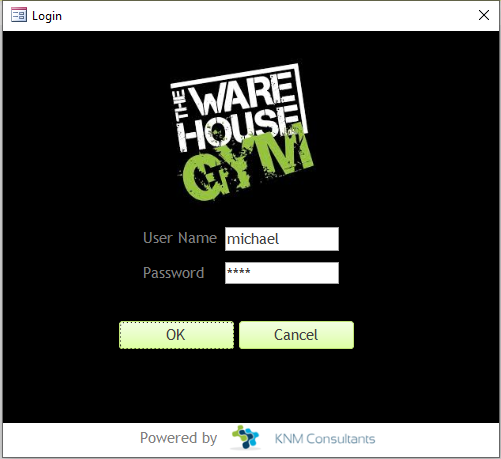
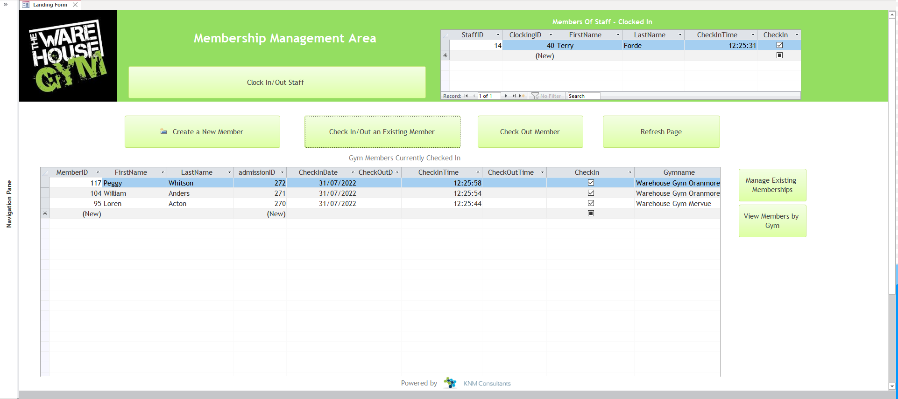
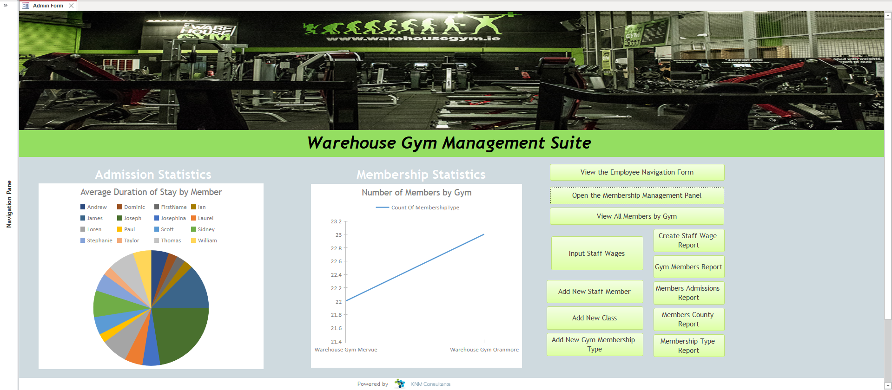
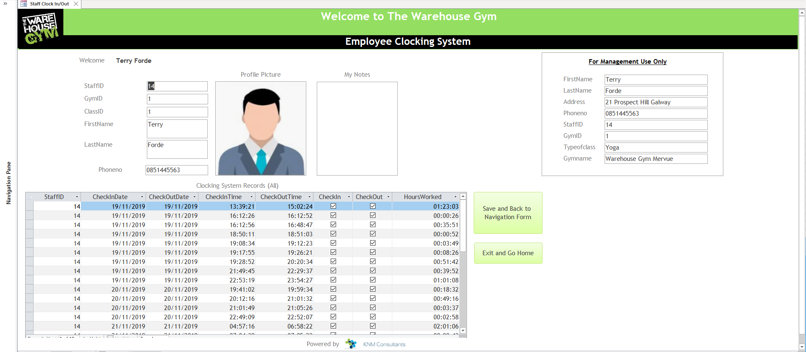

<h1 align="center">Web Application Development</h1>

# Table of Contents

- [Table of Contents](#table-of-contents)
- [Project Overview](#project-overview)
- [Technologies](#technologies)

  </h1>

# Project Overview

I developed this database as part of a group project between October and November as a fourth year project for a module called Application Development. This project combines elements we learned from previous modules such as Database Management Systems and Data Modelling as part of a Bsc Hons in Business Information Systems in GMIT.

The background to the project was that we were required to produce a Microsoft Access Database and a detailed specification for a small to medium sized company/organisation of our choice. The database specification included the following: Detailed Description of the Company and Purpose of Database, Mission Statement, Objectives of the Database, Rationale, Business Rules, List of Entities, Attributes, Assumptions, 1st, 2nd and 3rd Normal Form, List of fully Normalised Tables, Entity Relationship Diagram and Time Management Sheets. The project consisted of both professional documentation in terms of the production of a guidance document, technical report and practical implementation of the Database itself.

The end product resulted in an attractive looking application which is easy to use and provides a lot of functionality such as password protected login (Macros), management panel allowing overview of membership and admission statistics, ability to create reports (Queries), add new members, employees, staff wages, add memberships to customer profiles, configure gyms and membership pricing, and clock in and out functionality for both staff and customers of the gym with a live member management area listing all the staff and customers in the gym.

- Project Date: March/April 2020
- Included in this repo is:
  - [x] GymDatabase.accdb (Microsoft Access file)
  - [x] Project Manual

# Technologies

- [x] Microsoft Access
- [x] RDBMS Modelling

<h1 align="center">

</h1>
